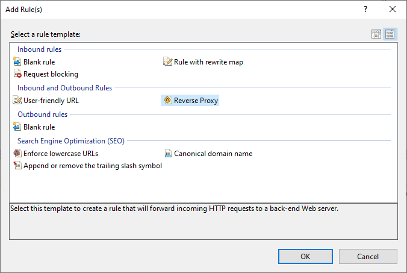
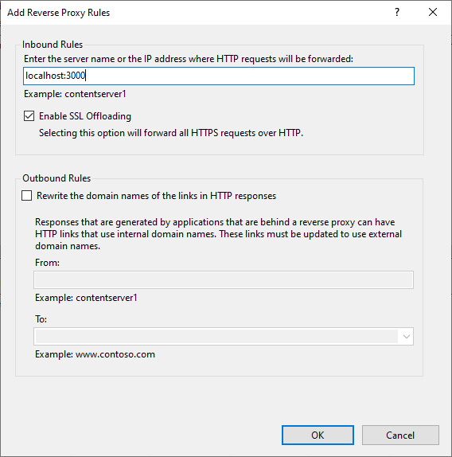

# Using IIS as a Reverse Proxy for a Node.js Application

Note that these instructions don't go into Outbound Rules
which may be necessary if changes to internal paths are required.

## Prerequisites

-   Windows server running IIS.
-   Node.js application running on the same or a different server.

## IIS Setup

Install the following two modules.

-   [URL Rewrite](https://www.iis.net/downloads/microsoft/url-rewrite)
-   [Application Request Routing](https://www.iis.net/downloads/microsoft/application-request-routing)

Select or create the "site" to use for the reverse proxy.

-   If it's the only application that will be running on the IIS server,
    using the Default Web Site is fine.

-   If a domain or subdomain will be used,
    create a new website.

-   It the reverse proxy will run under a subfolder,
    create a new application at the appropriate level.
    Note that not all applications can run under a subfolder,
    especially if their code relies heavily on absolute paths.

Open the URL Rewrite Module.  Select **Add Rule**.

Select "Reverse Proxy".

Under the "Inbound Rules", enter the internal Node.js server address and port.

If the reverse proxy is on a subfolder, you may need to edit the rule
to add the same subfolder to the Rewrite URL.

## IIS Gotchas

-   If pages aren't updating after changes,
    you may need to **disable Output Caching**.

-   If some requests are resulting in 403.501 errors,
    you may need to **disable Dynamic IP Restrictions**.

## Node.js Gotchas

-   You may need to **disable compression** on the Node.js server
    to allow IIS to proxy the data.

-   You may need to **disable etag headers** on the Node.js server
    if IIS is caching things it shouldn't.

-   If the application relies heavily on absolute links,
    and creating outbound rules is impossible
    (like if absolute links are used or made in JavaScript),
    a subfolder may not be an option, and a unique domain or subdomain may be required.

## References

-   [Deep Shah's Blog - How to Use IIS7 as Front End to Java Web Servers Like Tomcat and Jetty](http://www.gitshah.com/2013/06/how-to-use-iis7-as-front-end-to-java.html)

-   [Dev - Hosting a Node.js application in Windows with IIS as reverse proxy](https://dev.to/petereysermans/hosting-a-node-js-application-on-windows-with-iis-as-reverse-proxy-397b)

-   [Robert Wray - Getting a 403.501 error response from IIS? Check your 'Dynamic IP Restriction Settings'](https://robertwray.co.uk/blog/getting-a-403-501-error-response-from-iis-check-your-dynamic-ip-restriction-settings)

-   [StackOverflow - How do I setup reserve proxy in local IIS](https://stackoverflow.com/questions/58480493/how-do-i-setup-reverse-proxy-in-local-iis)

-   [StackOverflow - How to disable webpage caching in ExpressJS + NodeJS?](https://stackoverflow.com/questions/22632593/how-to-disable-webpage-caching-in-expressjs-nodejs)

### Outbound Rules

-   [Creating an outbound rule to modify the HTTP response header](https://docs.microsoft.com/en-us/iis/extensions/url-rewrite-module/modifying-http-response-headers#creating-an-outbound-rule-to-modify-the-http-response-header) - How to handle 302 redirections.
