# Managing OneDrive File Shares

When you need to share large files over email,
and the size of those files exceeds the limits set our mail server,
OneDrive provides a solution.

## Contents

-   [Accessing OneDrive](#-accessing-onedrive)
-   [Familiarize Yourself with OneDrive](#-familiarize-yourself-with-onedrive)
-   [Set Up Your OneDrive for Sharing](#-set-up-your-onedrive-for-sharing)
-   [Sharing Folders Using OneDrive](#-sharing-folders-using-onedrive)
-   [Downloading Shared Files from OneDrive](#-downloading-shared-files-from-onedrive)
-   [Tips, Tricks, and Important Notes](#️-tips-tricks-and-important-notes)

## 👶 Accessing OneDrive

To access OneDrive through your web browser,
**visit [office.com](https://www.office.com)**.

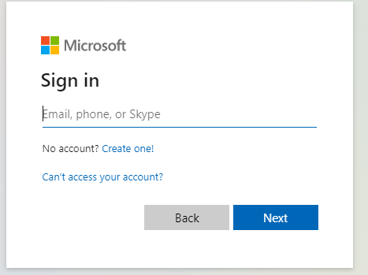

Log in using your **City email address**.

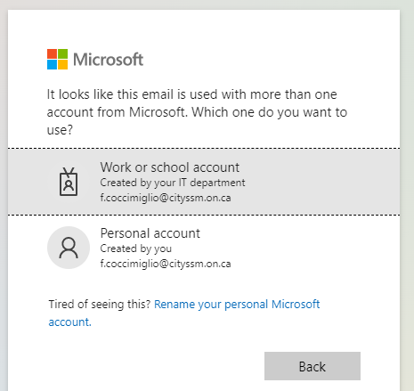

If asked, select **Work or school account**.

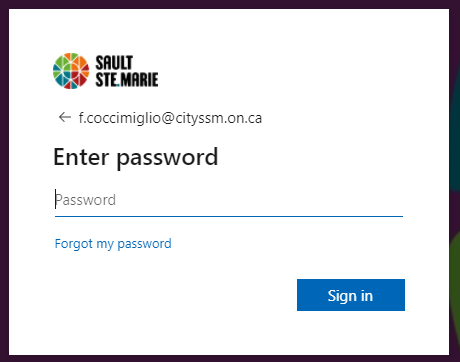

Enter your regular **Windows login password**.

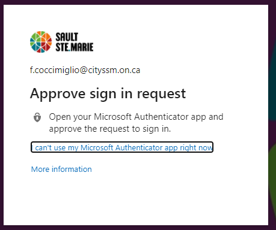

**Approve the multifactor authentication (MFA) request.**

Depending on your choice of MFA,
this may require approving with the Microsoft Authenicator app on your phone,
or entering a six-digit number displayed on a keychain device.

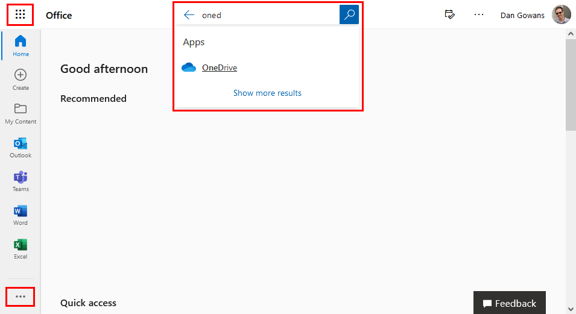

Depending on if you have used OneDrive before, the link may appear in a few different places.

-   Under "Home" in the left hand list of applications.
-   In the "App Launcher" menu, opened using the button in the top-left corner.
-   In the "View More Apps" menu, opened using the button in the bottom-right corner.
-   By searching for "OneDrive" in the "Search" field at the top.

## 👩‍🎓 Familiarize Yourself with OneDrive

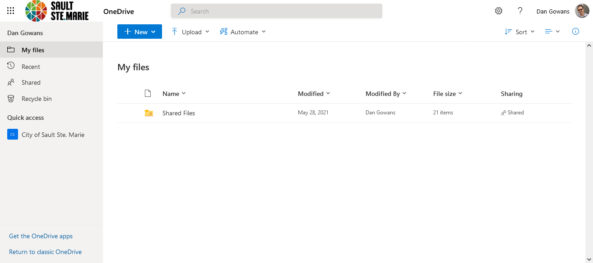

On the left side menu, you can select the area of OneDrive you want to access.
The most important options include:

-   **My Files**, which shows files in your personal OneDrive repository.
-   **Shared**, which shows files you are currently sharing and files shared with you by others.
-   **Recycle Bin**, which shows files you have deleted, with the option to recover them.

Files and folders are shown in the middle of the screen.

Above the files and folders is a toolbar of folder options.

## 💡 Set Up Your OneDrive for Sharing

Although not necessarily required, organizing your OneDrive prior to sharing
can greatly improve your sharing experience. 🙂

**I highly recommend starting by creating a folder named "Shared Files"
in the root of your OneDrive.**

> Having a folder grouping together all of your shared information
> helps keep things organized when you are sharing files with multiple people.
> It also helps keep you in the mindset that files saved in this folder
> will likely become available to people other than just yourself.

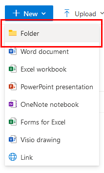

To create a new folder, click the blue **New** button,
and select **Folder**.

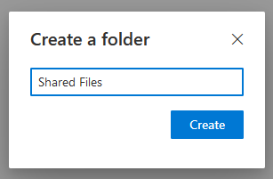

In the dialog window, enter the folder name.
Click **Create** to save it.

## 📤 Sharing Folders Using OneDrive

> ⭐ Although it is possible to share single files in OneDrive,
> it is **not recommended**
> as sharing folders is far easier to do securely.

Inside the **Shared Files** folder, create a new folder for the files
that will be shared.

> ⭐ Including the current date in the shared folder name
> can be helpful when it comes to cleaning up old shared folders.
>
> ⭐ When choosing a folder name for the folder you will be sharing,
> be sure **not to include** any information in the name that is confidential.
> Although recipients will not be able to browse parent folders,
> the full folder path will be shared with the recipient of the shared folder.

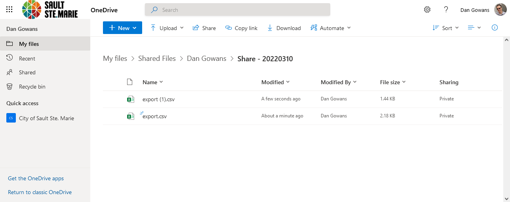

Open that new folder.  Upload the files that need to be shared.
Files can be uploaded using the **Upload** button in the top menu,
or by dragging the file from a Windows Explorer onto the web browser.

In the top menu, click **Share**.

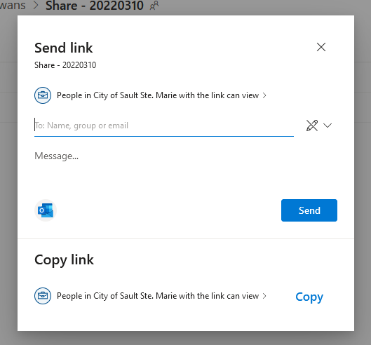

The first option lets you set the scope of the share.
By default, shares are limited to people with City email addresses.

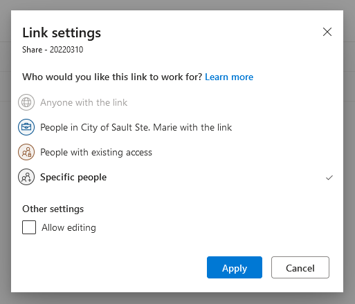

To share with people outside of the City,
change the scope to **Specific People**.

When setting the scope, you can also choose whether the recipients
will be able to upload their own files into the folder or not
by selecting the **Allow editing** option.

In the **To** field, enter the email addresses of the people
who will be receiving the shared folder.

After entering the email addresses of all of the recipients,
OneDrive can either send an email to the recipients for you,
or create a link **valid only for those recipients**
that can be included in your own email message.

## 📥 Downloading Shared Files from OneDrive

Whether recipients receive a link directly from OneDrive
or as part of an email you wrote, the process is the same.

Click the link.

-   Internal recipients log in with their City credentials.

-   External recipients will not require an account,
    but will need to verify their email address using a code
    sent by email when they use the link.

## 🧙‍♂️ Tips, Tricks, and Important Notes

⭐ Share a folder between yourself and a coworker to test things out.

> It's always easier to sort out problems internally
> before increasing your exposure to outside contacts.

⭐ When sharing links, only share links generated using the **Share**
or **Copy Link** buttons in OneDrive.

> **Never** copy the link from your web browser's address bar.
> The web browser uses a website address that will not work for the people
> you wish to share with.

⭐ **Clean up after yourself.**

> By default, once a shared folder is made, it stays available.
> You can see your current shares from the **Shared** link in the left-side menu.
> Consider removing links after they are no longer needed while their purpose
> is still fresh in your mind.
